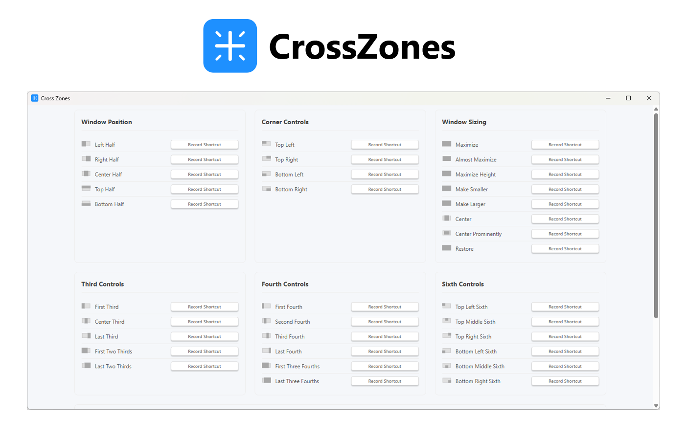

<p>

</p>

Simple cross-platform window moving and resizing utility using shortcuts.

## 📲 Installation

Download the latest release installer for your OS in the [Release](https://github.com/DaBs/crosszones/releases)

## 🚀 Development

### Prerequisites

- Node.js (Latest LTS version recommended)
- Rust (Latest stable version)
- Platform-specific build tools:
  - Windows: Microsoft Visual Studio C++ Build Tools
  - macOS: Xcode Command Line Tools
  - Linux: Build essentials and WebKit development libraries

### Installation

1. Clone the repository:
   ```bash
   git clone https://github.com/yourusername/crosszones.git
   cd crosszones
   ```

2. Install dependencies:
   ```bash
   npm install
   ```

3. Start the development server:
   ```bash
   npm run tauri dev
   ```

### Building

To build the application for your platform:

```bash
npm run tauri build
```

The built application will be available in the `src-tauri/target/release` directory.

## 🤝 Contributing

Contributions are welcome! Please feel free to submit a Pull Request.

## 📝 License

This project is licensed under the MIT License - see the LICENSE file for details.

## 🙏 Acknowledgments

- [Rectangle](https://rectangleapp.com/) for Mac, the original inspiration
